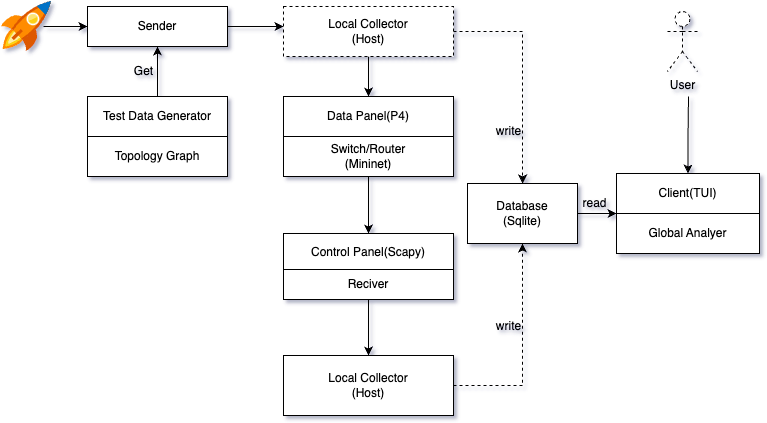
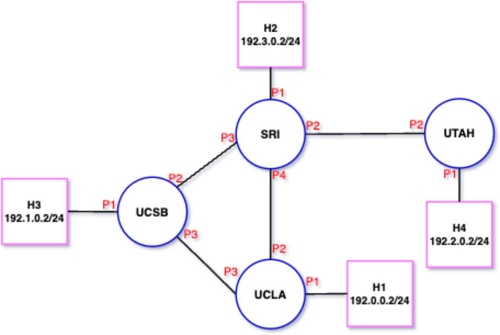
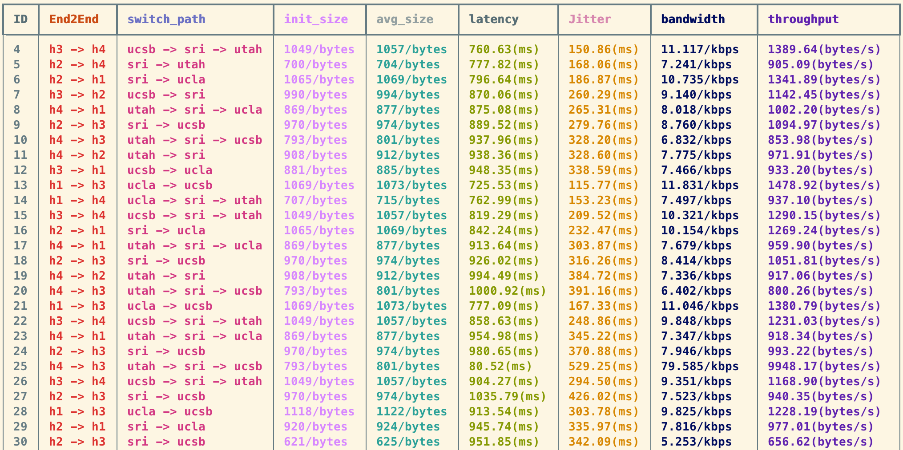

# Real Time Monitor System - Data Link Layer

## 1.Diagrams

- A Real-Time Monitor System at the Data Link Level is a type of monitoring system that is designed to capture and analyze network traffic at the data link layer. The data link layer is the second layer in the OSI model, and it is responsible for the reliable transfer of data between adjacent nodes on a network.

* Some key points in the system:
1. The system includes multiple components, such as the test package generator, sender, switches, receiver, local collector, global analyzer, and TUI.
2. The test package generator is responsible for creating the test data that will be sent through the system.
3. The sender sends the test data from the start host, which may also add some initial data.
4. The packet travels through multiple switches, each of which performs various operations such as forwarding, header addition, and calculation to help route the packet to its destination.
5. The receiver at the other end of the system receives the packet and passes it to the local collector for processing.
6. The local collector roughly processes the original data and stores it in the `db` database.
7. The global analyzer and TUI work together to deeply process the data and display it to the user, providing a more detailed view of the system's performance.

## 2.Project Component:

1. Topology Model: Based on ARPNet. The diagram also show the IP address and ports on all of the switches and hosts.
2. P4 code - Data panel: Collect all of the Original data, based on `v1model`, using `standard_metadata` data.
3. Control panel: Store all of the data to database and do some roughly calculation.
4. Client - Tui: Based on `Rich` terminal library. Result and Demo for this project

## 3.Metrics
1. Init Size: The first switch’s packet_length
2. Avg Size: The system record all of the switch’s packet_length, so the avg means mean value for each of end to end packet.
3. Latency: Time taken for packet to travel from source to destination (Host time)
4. Jitter: Standard deviation of packet delay (Based on latency and mean value of Latency)
5. Bandwidth: :(Total Bytes Transferred / Time) * 8 / 1000 (Kbps)
6. Throughput: (Total Bytes Transferred / Time) (bytes/s)

## 4.Other Research:

The current project is an early stage, I am thinking that I can actually expand more metrics, such as RTT (send back data), Network Congestion, Packet Loss (At first store id to `db`, and reupdate the data to `db`).
In addition to the performance level, we still can do security level monitoring, such as DDOS Attacks (Detecting a large volume of traffic from multiple sources) to give alerts or warn users.

## 5.Referrence:
- https://p4.org/p4-spec/p4-14/v1.0.5/tex/p4.pdf
- https://rich.readthedocs.io/en/stable/introduction.html
- https://docs.nvidia.com/networking-ethernet-software/cumulus-netq-24/Cumulus-NetQ-CLI-User-Guide/Monitor-Data-Link-Layer-Devices-and-Protocols/
- [Network Performance Management Software & Tool - ManageEngine OpManager](https://www.manageengine.com/network-monitoring/network-performance-management.html?adagroup=%20L1-OPM-Network%20Performance&device=c&network=o&keyword=network%20performance%20monitor&creative=&matchtype=p&searchterm=performance%20metrics%20for%20network%20monitor%20in%20data%20link%20layer%20or%20sdn&msclkid=af3f5fbadabf127306573bfabba192aa&utm_source=bing&utm_medium=cpc&utm_campaign=OPM-USA-Search-PH/BMM-INR-Bing-L1&utm_term=network%20performance%20monitor&utm_content=L1-OPM-Network%20Performance)
- [An Efficient Network Monitor for SDN Networks](https://dl.acm.org/doi/pdf/10.1145/3305218.3305255)

